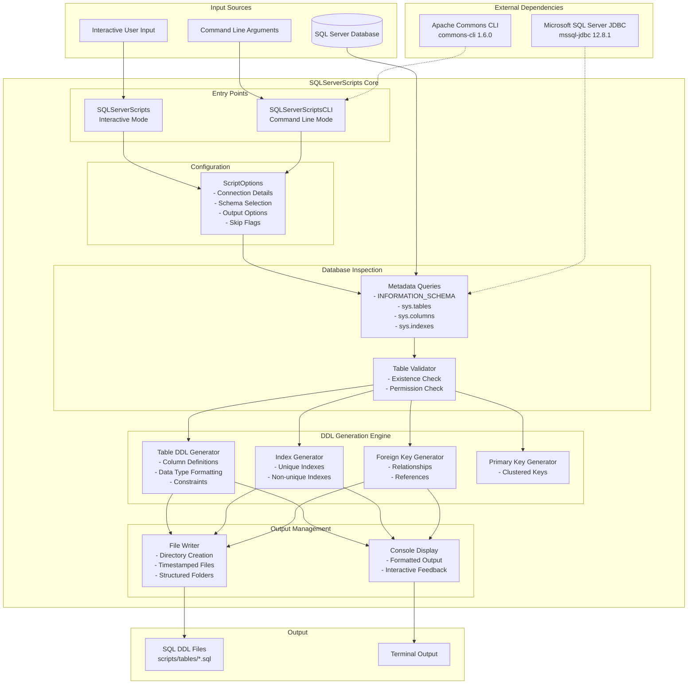
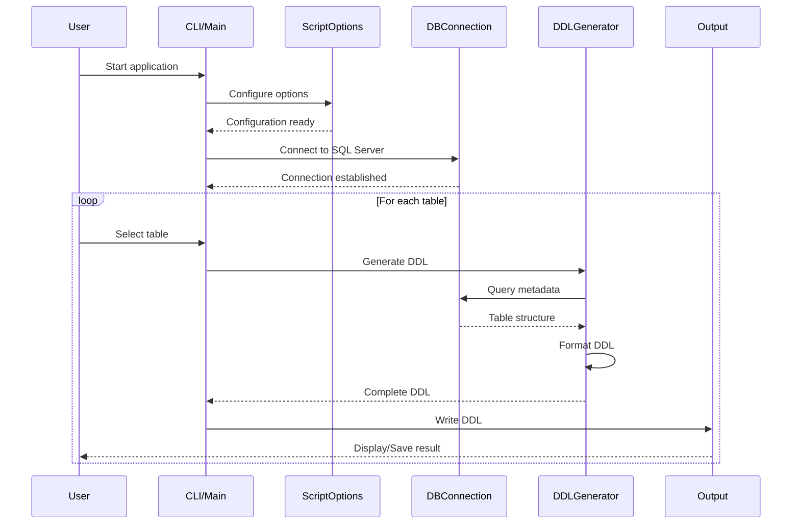
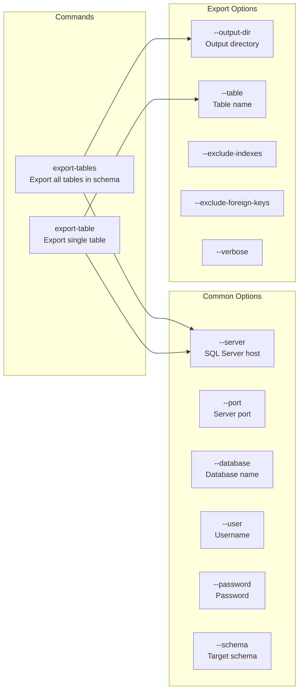
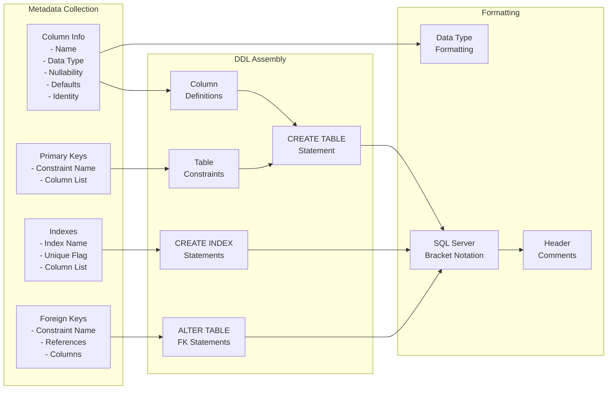
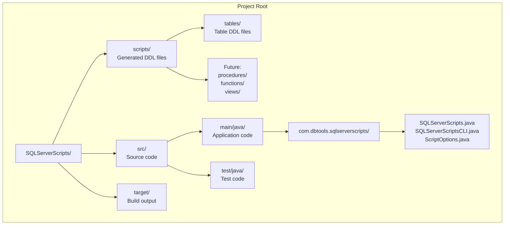
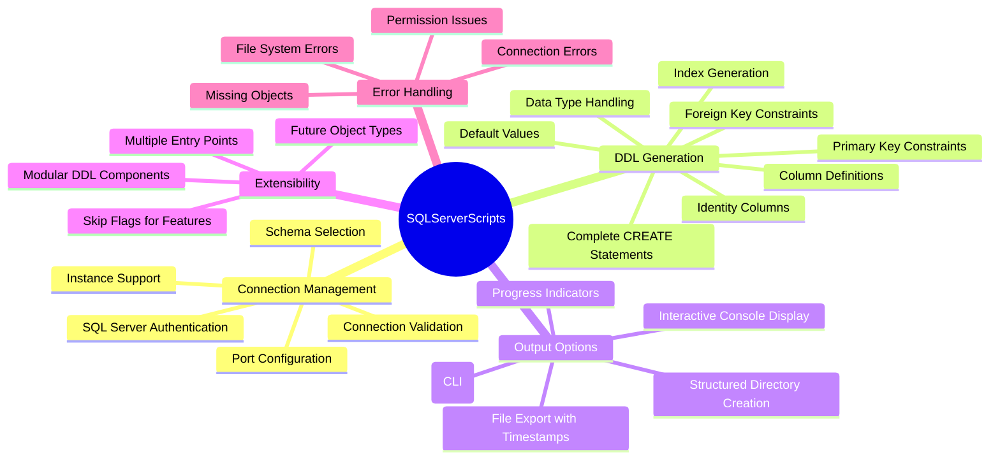
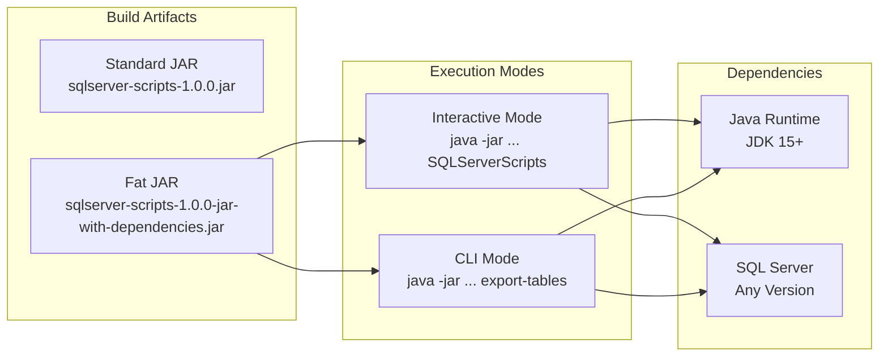

# SQLServerScripts Architecture Diagram

## System Overview

## Component Interaction Flow

## CLI Command Structure

## Data Processing Pipeline

## Directory Structure

## Key Features Map

## Deployment Architecture

